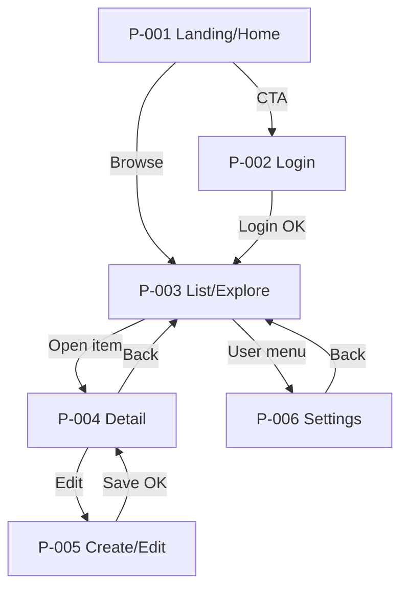
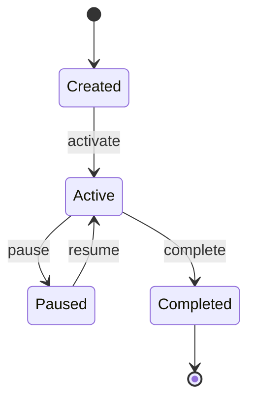
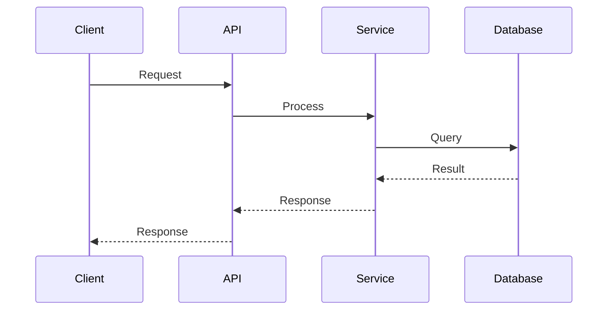

# Design

{本节用于描述系统级的设计与对接约定，目标是让不同模块/团队在同一套抽象与接口边界下协作。}

## 设计文档的定位（宏观 / 协调优先）

{本文档用于描述系统级的设计与对接约定，目标是让不同模块/团队在同一套抽象与接口边界下协作（what/why/how 的“宏观 how”）。}

{业界常见做法是：}

- {组件内部细节（类/函数级接口、docstring、局部实现策略）应下沉到组件自身的文档与代码注释中，而不是堆在 Design 的主文档里。}
- {数据模型细节（表结构/字段/索引/ER 图等）也应由对应的领域/组件负责在自身文档中维护，避免主文档承担过多局部细节。}
- {Design 主文档更应关注：边界、契约、数据与流程、错误与兼容策略、跨模块依赖与对齐点。}

{备注：如果确实需要组件级设计，通常更适合在 Tasks 阶段按具体任务拆解补充（并指向对应代码/模块）。}

### Page & Component Inventory

#### 页面清单（6 个页面）

> {本节只做“页面级”清单与对接点梳理，不展开组件内部实现细节。每个页面条目以“路由/入口/权限/关键组件/关键状态/对接点”为主，方便跨模块协作与验收对齐。}

- **P-001 {页面名，例如 Landing/Home}**
  - **路由**：`{path}`
  - **入口**：{从哪里进入；例如“外部链接/应用启动/登录后默认页”}
  - **用户与权限**：{匿名/登录用户/管理员；鉴权方式}
  - **核心区块（页面级组件）**：
    - {Header / Nav}
    - {Primary CTA / 核心列表或信息卡}
    - {Footer / Legal}
  - **关键状态**：{loading/empty/error/success 等；是否需要 skeleton}
  - **对接点**：{依赖的 API/事件/配置；只写接口边界，不写字段细节}
  - **埋点/监控**：{PV/点击/转化；错误上报}

- **P-002 {页面名，例如 Login/Sign In}**
  - **路由**：`{path}`
  - **入口**：{Landing 的 CTA；或被路由守卫拦截后跳转}
  - **用户与权限**：{匿名}
  - **核心区块（页面级组件）**：
    - {登录表单（账号/密码/验证码/第三方登录）}
    - {错误提示与帮助入口}
  - **关键状态**：{提交中、失败重试、锁定/频控、验证码刷新}
  - **对接点**：{Auth API；登录成功后的重定向策略}
  - **埋点/监控**：{登录成功率、失败原因分布}

- **P-003 {页面名，例如 List/Explore}**
  - **路由**：`{path}`
  - **入口**：{导航进入；或登录后默认页}
  - **用户与权限**：{登录用户}
  - **核心区块（页面级组件）**：
    - {筛选/搜索区}
    - {列表/表格（分页/无限滚动）}
    - {批量操作（可选）}
  - **关键状态**：{筛选中、分页加载、空结果、接口错误}
  - **对接点**：{List API；筛选参数约定；URL query 同步策略}
  - **埋点/监控**：{搜索使用率、筛选转化、列表加载耗时}

- **P-004 {页面名，例如 Detail}**
  - **路由**：`{path}`（含 `{id}`）
  - **入口**：{从列表点击；或外部分享链接}
  - **用户与权限**：{登录用户；是否有资源级权限校验}
  - **核心区块（页面级组件）**：
    - {详情头部（标题/状态/操作按钮）}
    - {详情信息区块（分组展示）}
    - {历史/日志/评论（可选）}
  - **关键状态**：{不存在/无权限/已删除；乐观更新（可选）}
  - **对接点**：{Detail API；更新/删除 API；权限错误处理}
  - **埋点/监控**：{详情页停留时长、关键操作点击}

- **P-005 {页面名，例如 Create/Edit}**
  - **路由**：`{path}`（new 或 `{id}/edit`）
  - **入口**：{列表页“新增”；详情页“编辑”】【可用性取决于权限】}
  - **用户与权限**：{登录用户；编辑权限}
  - **核心区块（页面级组件）**：
    - {表单区（分组/校验/联动）}
    - {保存/取消/草稿（可选）}
  - **关键状态**：{表单校验失败、提交中、提交失败、离开未保存提示}
  - **对接点**：{Create/Update API；字段校验口径（前后端一致性）}
  - **埋点/监控**：{提交成功率、失败原因、表单耗时}

- **P-006 {页面名，例如 Settings/Profile/Admin}**
  - **路由**：`{path}`
  - **入口**：{用户菜单/设置入口}
  - **用户与权限**：{登录用户/管理员（若是 Admin）}
  - **核心区块（页面级组件）**：
    - {设置分区（账户/偏好/安全）}
    - {保存与反馈提示}
  - **关键状态**：{读取失败、保存失败、部分保存（可选）}
  - **对接点**：{Profile/Settings API；配置下发策略}
  - **埋点/监控**：{设置保存成功率、关键开关使用率}

#### 页面流向图



## Architecture Overview

{High-level system architecture}

```mermaid
graph TD
    subgraph "External"
        Client[Client Application]
    end

    subgraph "System Boundary"
        API[API Gateway]
        Service[{Feature} Service]
        DB[(Database)]
    end

    Client --> API
    API --> Service
    Service --> DB
```

## State Machine

{If applicable, show state transitions}



## Sequence Diagrams

### UC-xxx {Use Case Name}



## API Design

### API-001 {Endpoint Name}

**Endpoint**: `{METHOD} /api/v1/{resource}`

**Description**: {what this endpoint does}

{通用标准（例如 API 的请求/响应格式与状态码约定、Error Handling、Security Considerations、Performance Considerations 等）不在 Design 中重复展开，原因是这些内容更适合由独立工作流统一维护，以避免口径漂移与跨文档不一致；在此仅关注与本需求强相关的接口边界与对接点。}

{Component Design 与 Data Model 属于领域/组件内部设计，不在主 Design 中维护；这些细节应下沉到对应模块的文档与代码注释中，以保持主文档的宏观抽象用于协调整体对接。若需要对齐，建议在 Tasks 阶段按任务补充并链接到对应模块。}
