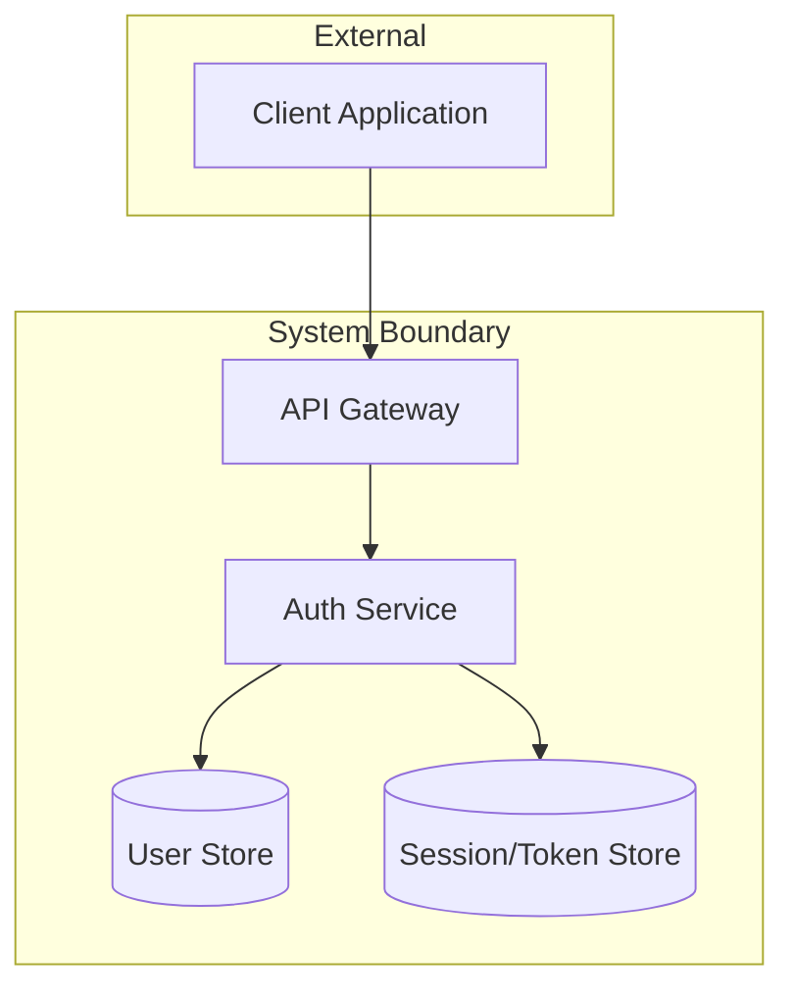
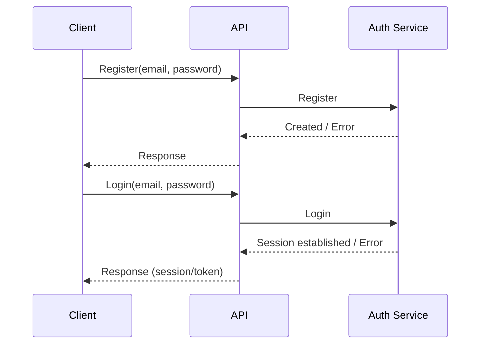

# 用户认证

## Requirements

本示例用于展示：当用户给出 Requirements / Design / Specs / 约束后，`plan` skill 的目标产物应如何组织为**单文件**（仅包含 `Requirements` / `Specs` / `Design` / `Phases` 四段）。

- 本示例只演示“结构与口径”，不追求实现细节的完整性。
- `Design` 主文档强调**边界、契约、流程**；组件内部细节与数据模型细节应下沉到模块文档/代码注释。

当前系统缺少用户认证能力，所有功能均可匿名访问。随着引入用户私有数据（偏好设置、个人资料、订单/账单等），我们需要建立统一的身份识别与会话机制，以支持：

- 用户登录后访问“仅对本人可见”的数据与功能
- 服务端对敏感操作进行鉴权与审计
- 在不显著牺牲体验的情况下提升安全性与可恢复性

### Goals

- 用户可以使用邮箱 + 密码注册账号并登录
- 登录后能维持会话，并可访问需要登录的页面/接口
- 会话在浏览器重启后仍可恢复（在安全策略允许范围内）

### Non-Goals

- 社交登录（Google/GitHub 等）
- 双因素认证（2FA）
- 企业 SSO
- 账号体系之外的用户画像/资料编辑

### Scope

- 邮箱 + 密码注册
- 登录/登出
- 会话管理（访问令牌 + 刷新令牌或等价机制）
- 忘记密码/重置密码
- 受保护资源的鉴权中间件/网关策略

### Non-Scope

- RBAC / 权限系统（角色、权限点、后台管理）
- 管理员创建/禁用用户的完整运营后台

### Functional Requirements

<!-- // EARS（Easy Approach to Requirements Syntax）是一种用于编写清晰、可验证功能需求的句式模板；参考：`what-is-ears-format.md`。 -->

#### 常规（Ubiquitous）需求

- **FR-001**: 系统应支持邮箱 + 密码注册账号。
- **FR-002**: 系统应支持邮箱 + 密码登录。

#### 事件驱动（Event-Driven）需求

- **FR-010**: 当用户提交包含有效邮箱与密码的注册请求时，系统应创建新用户账号。
- **FR-011**: 当用户注册邮箱已存在时，系统应拒绝注册请求并返回明确的错误码。
- **FR-012**: 当用户提交有效凭证时，系统应建立已认证会话。
- **FR-013**: 当用户提交无效凭证时，系统应拒绝请求并返回 HTTP 401。

#### 状态驱动（State-Driven）需求

- **FR-020**: 在用户处于已认证状态期间，系统应为请求上下文附加可用于鉴权决策的用户身份信息。

#### 非期望行为（Unwanted Behavior）需求

- **FR-030**: 如果用户未认证，则系统不得允许其访问受保护资源。

### Success Metrics

| Metric                    | Current | Target  | How to Measure |
|--------------------------|---------|---------|----------------|
| 注册到首次登录成功率 | N/A | ≥ 95% | 客户端埋点 + 服务端日志对齐 |
| 受保护接口的未授权访问拦截正确率 | N/A | 100% | 集成测试 + 安全测试 |

### Dependencies

- **D-001**: 邮件服务能力（用于验证/重置密码）
- **D-002**: 统一的错误码规范（若项目已有标准，以标准为准）

### Constraints

- **C-001**: 不在服务端/客户端日志中记录明文密码、会话令牌等敏感信息
- **C-002**: 安全策略（例如 Cookie/Token 存储方式、过期时间）需满足现有合规与安全要求

### Assumptions

- **A-001**: 系统存在“受保护资源/页面”的清单或可被识别的路由前缀
- **A-002**: 业务允许通过登录态区分用户身份（非匿名强制）

### References

- **REF-001**: `what-is-ears-format.md`

## Specs

- [ ] **SPEC-001**：鉴权边界统一化
  - **背景 / 目标**：当前各接口鉴权逻辑分散，需统一由 API Gateway 或中间件执行，降低遗漏风险
  - **范围**：所有受保护路由；不覆盖公开接口（注册/登录入口）
  - **关键决策**：鉴权由 API Gateway 统一处理，下游服务仅消费身份上下文，不重复鉴权
  - **实现约束**：
    - 下游服务必须通过统一身份上下文获取 userId 等字段，不得自行解析令牌
  - **接口 / 对接点**：API Gateway 向下游注入的用户身份上下文字段（userId / tenantId 等）
  - **命令 / 操作**：
  - **验收（勾选即证据）**：
    - [ ] 未登录访问受保护资源返回 401
    - [ ] 下游服务可从请求上下文中读取 userId

- [ ] **SPEC-002**：会话过期与刷新策略
  - **背景 / 目标**：明确访问凭证与刷新凭证的生命周期，支持安全登出
  - **范围**：访问令牌、刷新令牌的颁发、过期与撤销；不覆盖 SSO/OAuth
  - **关键决策**：访问凭证短期有效；刷新凭证可撤销；登出立即使刷新凭证失效
  - **实现约束**：
    - 访问凭证过期时间需在配置中可调，不硬编码
    - 刷新凭证撤销状态必须持久化（不可仅存内存）
  - **接口 / 对接点**：刷新令牌存储（Session/Token Store）；令牌撤销接口
  - **命令 / 操作**：
  - **验收（勾选即证据）**：
    - [ ] 访问凭证过期后请求返回 401
    - [ ] 登出后刷新凭证失效，无法再获取新的访问凭证

- [ ] **SPEC-003**：错误返回结构化
  - **背景 / 目标**：客户端需稳定识别错误类型以作出相应处理（重试/跳转登录/提示用户）
  - **范围**：认证相关接口的错误响应；不覆盖业务层错误码规范（以项目统一标准为准）
  - **关键决策**：HTTP 状态码 + 结构化错误码双重标识，客户端以错误码为主
  - **实现约束**：
    - 错误码需覆盖：邮箱已存在、密码不合法、凭证错误、未授权、会话过期
  - **接口 / 对接点**：错误响应体格式（与错误码规范对齐）
  - **命令 / 操作**：
  - **验收（勾选即证据）**：
    - [ ] 各错误场景返回约定的 HTTP 状态码与错误码
    - [ ] 客户端可通过错误码区分"凭证错误"与"会话过期"

## Design

### Architecture Overview

### Sequence Diagrams

#### UC-001 注册 + 登录（高层流程）

### API Design

#### API-001 Register

- **Endpoint**: `POST /api/v1/auth/register`
- **Description**: 创建用户账号

#### API-002 Login

- **Endpoint**: `POST /api/v1/auth/login`
- **Description**: 建立会话（签发访问令牌与刷新令牌，或返回等价会话凭证）

#### API-003 Logout

- **Endpoint**: `POST /api/v1/auth/logout`
- **Description**: 使当前会话失效（撤销刷新凭证/清理 Cookie 等）

## Phases

### PHASE-100: 依赖与口径准备

本 Phase 聚焦于明确鉴权边界、对接邮件服务、统一错误码，为后续接口实现奠定基础。

- [ ] **明确受保护资源清单与鉴权边界**：确认受保护路由/资源规则及"身份上下文"字段定义（userId 等），输出边界约定文档
- [ ] **邮件服务对接**：明确发送频率限制、模板与失败重试策略，输出 `docs/auth/email.md`
- [ ] **统一错误码与客户端可识别的错误结构**：至少覆盖邮箱已存在、密码不合法、凭证错误、未授权、会话过期，输出 `docs/auth/errors.md`

### PHASE-200: 核心接口与会话能力

本 Phase 聚焦于打通注册/登录/登出主流程，落地鉴权中间件，完成核心会话能力。

- [ ] **注册接口实现**：含输入校验、重复邮箱处理；验收：重复邮箱返回稳定错误码，成功后可登录
- [ ] **登录接口实现**：建立会话/签发凭证；验收：错误凭证 401，成功后可访问受保护资源
- [ ] **登出接口实现**：撤销刷新凭证/清理 Cookie；验收：登出后刷新凭证失效，再访问受保护资源应失败
- [ ] **受保护资源鉴权中间件/网关策略落地**：验收：未登录访问返回 401，登录后可访问

### PHASE-300: 测试与安全验证

本 Phase 聚焦于端到端流程验证、安全加固与会话策略测试，确保核心目标可验收。

- [ ] **集成测试：注册→登录→访问受保护资源→登出→再次访问**：以端到端路径验证核心目标，输出 `tests/integration/auth-flow.*`
- [ ] **安全测试：暴力破解/频率限制/敏感字段不落日志**：输出关键风险点的可复现实验与结论，输出 `tests/security/auth-security.*`
- [ ] **会话过期与刷新策略测试**：覆盖访问凭证过期、刷新凭证撤销、登出后刷新失败，输出 `tests/integration/auth-refresh.*`

### PHASE-400: 文档与收尾

本 Phase 聚焦于更新接口文档、运行手册，并完成对齐与通知。

- [ ] **更新接口文档**：仅描述本需求强相关的边界与对接点，输出 `docs/api/auth.md`
- [ ] **更新运行手册/排障指南**：覆盖常见错误码与排查路径，输出 `docs/runbook/auth.md`
- [ ] **更新 Changelog 并通知相关 Stakeholders**：记录与本需求相关的关键变更点，通知范围与渠道以项目约定为准
