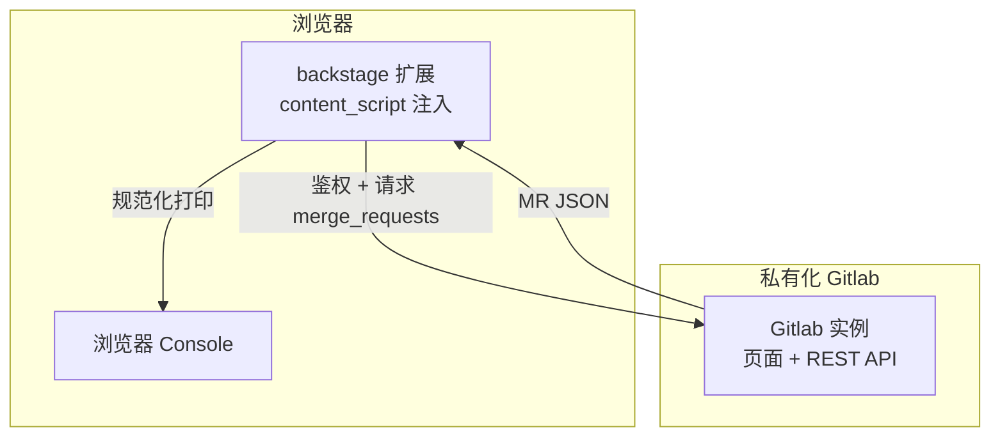
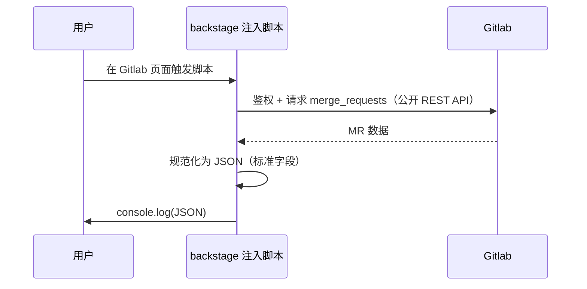

# PLAN-001: Gitlab Issues 注入式读取可行性验证

> updated_by: HBR - GLM-5.2
> updated_at: 2026-07-01 23:40:00
> Vision Id: VISION-003
> 来源裁决: vision workflow 对话裁决（结果三：转 Plan）
> 基线: `.context/current-plan.md`

## Requirements

本需求用于验证「在私有化部署的 Gitlab 上，通过浏览器注入 JS 读取 issues 并规范化为 JSON」的端到端可行性。当前 backstage 平台尚无从私有化 Gitlab 抓取 issues 数据的能力，本阶段不直接建设平台侧消费链路，而是先用最小成本验证「注入式读取」这条路是否走得通，为后续是否正式接入提供决策依据。

核心要回答的问题：能否借助 Tampermonkey 注入脚本、复用浏览器登录态或 person token 调 Gitlab 接口，把 issues 读出来并在 console 打印成标准 JSON。鉴权机制（token / cookie）、接口选型（公开 REST API / 页面内部接口）与注入方案本身既是实现手段、也是本 Plan 的调研目标，需在执行中对比择优并固化结论。

### Goals

- 验证注入式 JS 读取机制的端到端可行性：Tampermonkey 注入 → 鉴权请求 → 读取 issues → 规范化 JSON → console 打印
- 产出可运行的注入脚本原型，能在浏览器 console 打印出有值的 issues JSON
- 完成鉴权机制、接口选型、注入方案三项选型，输出决策与理由（含对比维度与最终选择）

### Non-Goals

- backstage 平台消费该 JSON（不在本 Plan 范围，后续迭代再议）
- 任何写回操作（创建 MR、评论、修改/关闭 issue 等）
- 性能优化（低频人工使用，不考虑并发、缓存、限流等）
- 生产级健壮性（自动重试、错误恢复、监控告警等，本阶段仅验证可行性）

### Scope

- Tampermonkey 注入 JS 脚本（读取 issues 并 console.log）
- 鉴权机制调研：person token 与 cookie 两条路线对比择优
- 接口选型调研：Gitlab 公开 REST API 与页面内部接口对比择优
- issues 数据规范化为 JSON（使用 Gitlab 标准 API 字段，不自定义/重命名）

### Non-Scope

- 数据落库 / 持久化 / 文件导出
- UI 展示与交互（仅 console 打印）
- 自动化测试与 CI 集成
- 多项目批量读取 / 复杂筛选条件 / 分页全量拉取

### Functional Requirements

<!-- // EARS（Easy Approach to Requirements Syntax）是一种用于编写清晰、可验证功能需求的句式模板；参考：`what-is-ears-format.md`。 -->

#### 常规（Ubiquitous）需求

- **FR-001**: 系统应通过 Tampermonkey 在私有化 Gitlab 页面注入并执行 JS 脚本。
- **FR-002**: 系统应将读取到的 issues 规范化为 JSON 并在浏览器 console 打印。
- **FR-003**: 系统应使用 Gitlab issues 标准字段，不得自定义或重命名字段。

#### 事件驱动（Event-Driven）需求

- **FR-010**: 当用户在 Gitlab 页面触发脚本（或脚本按匹配规则自动执行）时，系统应发起 issues 读取请求。
- **FR-011**: 当鉴权凭证有效且目标项目存在 issues 时，系统应获取数据并打印 JSON。
- **FR-012**: 当鉴权凭证缺失或失效时，系统应在 console 输出可识别的错误提示，且不得在提示中暴露凭证明文。

#### 状态驱动（State-Driven）需求

- **FR-020**: 在脚本执行期间，系统应保持只读，不得发起任何写操作。

#### 非期望行为（Unwanted Behavior）需求

- **FR-030**: 如果读取目标项目无 issues 数据，则系统不得抛出未捕获异常，应在 console 输出空结果提示。
- **FR-031**: 系统不得执行任何写回操作（创建/修改/删除 issues、MR、评论等）。

### Success Metrics

<!-- // 默认不写性能指标（低频人工使用，性能非本需求关注点）。 -->

| Metric | Current | Target | How to Measure |
|---|---|---|---|
| 注入读取端到端可行性 | N/A | 可行 | 人工验收：运行脚本后 console 打印出有值的 issues JSON |
| 选型决策完整度 | N/A | 鉴权 + 接口 + 注入均有决策与理由 | 人工验收：Plan 内含三项选型结论与对比理由 |
| 字段规范性 | N/A | 全部为 Gitlab issues 标准字段 | 人工验收：console 输出字段对照 Gitlab API 文档 |

### Dependencies

- **D-001**: 私有化 Gitlab 实例的访问权限（可登录账号）
- **D-002**: 浏览器已安装 Tampermonkey 或等价用户脚本管理器
- **D-003**: 至少一个含 issues 数据的 Gitlab 项目（验证时由人工指定）

### Constraints

- **C-001**: 只读，禁止任何写回操作
- **C-002**: 低频人工使用，不考虑性能
- **C-003**: 鉴权凭证（token / cookie）不得在 console 明文打印或写入日志
- **C-004**: 脚本以原生 JS 实现，不引入外部依赖（保持 POC 简洁，便于人工审查与复用）

### Assumptions

- **A-001**: 私有化 Gitlab 支持 REST API v4（待 PHASE-100 确认；若不支持则回退页面内部接口）
- **A-002**: 验证人拥有可读取 issues 的项目访问权限
- **A-003**: Gitlab issues 标准 API 字段已能满足本 POC 的数据需求，无需额外扩展

### References

- **REF-001**: `.context/current-plan.md`（需求来源，VISION-003）
- **REF-002**: Gitlab REST API 文档（issues 端点：`GET /api/v4/projects/:id/issues`）

## Specs

- [ ] **SPEC-001**：鉴权机制选型（person token / cookie）
  - **背景 / 目标**：注入脚本调用 Gitlab 接口需鉴权，须在 token 与 cookie 两条路线间择优，明确获取方式与失效兜底
  - **范围**：鉴权方式选择与凭证获取/失效处理；不覆盖权限模型与角色管理
  - **关键决策**：待 PHASE-100 调研后定；决策维度——获取成本、失效兜底难度、安全性、是否需额外配置；当前无前置约束，两条路线均调研
  - **实现约束**：
    - 凭证不得在 console 明文打印
    - token 路线需说明获取步骤与失效后的处理；cookie 路线需说明会话过期兜底
  - **接口 / 对接点**：Gitlab API 鉴权头（`PRIVATE-TOKEN` 或 `Authorization: Bearer`）或浏览器已登录 Cookie
  - **命令 / 操作**：N/A
  - **验收（勾选即证据）**：
    - [ ] 两条路线对比结论完整
    - [ ] 最终选择含理由与失效兜底说明

- [ ] **SPEC-002**：接口选型（公开 REST API / 页面内部接口）
  - **背景 / 目标**：确定读取 issues 的数据来源，优先稳定且字段标准的方案
  - **范围**：REST v4 公开 API 与页面内部接口（页面 DOM / 内部 GraphQL）对比
  - **关键决策**：待 PHASE-100 调研后定；优先公开 API（字段标准、版本稳定）；API 不可用时回退页面内部接口
  - **实现约束**：
    - 字段使用 Gitlab 标准 API 字段，不自定义
  - **接口 / 对接点**：`GET /api/v4/projects/:id/issues` 或页面内部数据来源
  - **命令 / 操作**：N/A
  - **验收（勾选即证据）**：
    - [ ] 两条路线对比结论完整
    - [ ] 最终选择含理由

- [ ] **SPEC-003**：注入方案
  - **背景 / 目标**：确定 JS 注入载体，Tampermonkey 为主，评估是否有更优方案
  - **范围**：注入载体选型与脚本运行方式
  - **关键决策**：Tampermonkey 为主方案；备选（浏览器 DevTools Snippet、bookmarklet）仅作对比记录，不作为交付
  - **实现约束**：
    - 脚本以原生 JS 实现，不引入外部依赖
  - **接口 / 对接点**：Tampermonkey 脚本元数据（`@match` / `@run-at` 等）
  - **命令 / 操作**：N/A
  - **验收（勾选即证据）**：
    - [ ] Tampermonkey 注入后脚本可执行
    - [ ] 备选方案对比已记录

- [ ] **SPEC-004**：issues 数据规范化
  - **背景 / 目标**：读取结果以标准 JSON 在 console 打印，供后续潜在消费
  - **范围**：issues 列表的 JSON 序列化
  - **关键决策**：直接使用 Gitlab API 原始响应字段，不自定义/重命名
  - **实现约束**：
    - 输出为合法 JSON
  - **接口 / 对接点**：console 输出（`console.log(JSON.stringify(...))`）
  - **命令 / 操作**：N/A
  - **验收（勾选即证据）**：
    - [ ] console 输出为合法 JSON
    - [ ] 字段为 Gitlab issues 标准字段

## Design

本节描述注入式读取链路的宏观设计与对接边界。本 POC 无 UI 页面，不适用页面清单（Page Inventory）模板，故聚焦于架构链路、鉴权路线、读取流程与错误策略。

### Architecture Overview

### 鉴权路线

> updated_by: HBR - GLM-5.2
> updated_at: 2026-07-02 10:29:00
> 来源: PHASE-100 / TASK-110 选型结论回填

- **最终选择**：**cookie 路线**（复用浏览器已登录会话，同源 `fetch` 由浏览器自动携带 cookie 调 REST API v4）。
- **决策依据**：四维度对比（获取成本 / 失效兜底 / 安全性 / 配置成本）中，cookie 路线在获取成本、配置成本上为零/低，安全性上凭证不入脚本源码、C-003 内在满足；TASK-100 已实证 cookie 会话可调通 API v4 与 MR 端点。详见 `.context/current-task.md` → TASK-110 选型对比章节。
- **失效兜底**：会话过期（401）时 console 输出可识别提示（不含凭证明文），用户浏览器重新登录后恢复，无需改代码。
- **备选**：person token 路线文档化保留，若 cookie 会话稳定性不足可切换（作用域收敛 `read_api`，需补 token 获取与防明文逻辑），当前不启用。

### 数据来源路线

> updated_by: HBR - GLM-5.2
> updated_at: 2026-07-02 23:10:00
> 来源: PHASE-100 / TASK-120 选型结论回填

- **最终选择**：**公开 REST API**（`GET /api/v4/projects/:id/issues`）为主路线，与 Plan「优先公开 API，不可用则回退内部接口」一致。
- **决策依据**：字段标准性 / 稳定性 / 可达性三维度均指向 REST API——响应字段即 Gitlab 标准 API 字段（天然满足 FR-003）、API v4 版本化有文档契约保证稳定性、TASK-100 已实证 API v4 可达（version + MR 端点 → 200）。
- **字段策略**：直接消费原始响应字段，不自定义/不重命名；字段细节以官方文档（REF-002）为准，不下沉到主文档。
- **路径编码约束**：项目路径须 `encodeURIComponent` 单层编码为 `%2F`；未编码或双编码 `%252F` 均 404；数字 id 可用（TASK-100 实证）。
- **回退条件**：PHASE-200 首次对 issues 端点实拨确认不可达（排除路径编码问题）则回退页面内部接口，当前不预先启用。
- **残留风险**：issues 端点尚未直接实拨，基于 API v4 体系内 MR 端点可用作同构推断；实拨留待 PHASE-200 首次真实调用时闭环确认，并由回退条件兜底。

> updated_by: HBR - GLM-5.2
> updated_at: 2026-07-02 23:54:00
> 来源: PHASE-100 / TASK-130 选型结论回填 + 跨 Phase 语义纠错

### 注入路线

- **最终选择**：**backstage 扩展**（本仓库 `crx/manifest.json`，MV3）为注入载体，**非 Tampermonkey**。
- **决策依据（既定事实，非调研）**：`content_scripts` 在 `<all_urls>` 于 `document_end` 注入 `js/backstage.js` → Gitlab 页自动被注入，无需额外载体；`permissions` 含 `scripting`/`tabs`/`activeTab`，`host_permissions: <all_urls>`；`route`/`verb` API 由 `frontstage.js`（web_accessible_resource）提供。
- **frontstage 业务脚本归属**：业务脚本（host 站点脚本）不在本 backstage 仓库内，而在独立的 `frontstage` 仓库（monorepo，每个 host 一个 `packages/<host>/` 包）中开发与发布。注入机制（backstage 扩展 + `route`/`verb`）由本仓库提供并暴露于 `window.backstage`；业务脚本以 backstage 站点脚本约定承载（参考 `frontstage` 仓库 `packages/zhihu.com/` 样板，用 `@head/frontstage-utils/ready` 的 `$ready` 包裹在 `READY` 后执行）。本 backstage 仓库内 `packages/frontstage/` 下的 `www.example.com` 等为旧规范遗留，不作为新增 host 的落点。
- **备选处置**：Tampermonkey / DevTools Snippet / bookmarklet 不再对比——backstage 已是 in-house 成熟注入方案，由既定事实取代，重复选型无价值。
- **C-004 符合**：注入脚本（smoke test / 后续 MR 读取）为原生 JS，无 import/外部依赖；扩展自身打包的 vendors 属扩展实现，不构成 POC 注入脚本的外部依赖。
- **人工验收**：浏览器 smoke test HV-1~4 全通过（2026-07-02）——注入可用、route/verb 返回预期、MR 标准字段符合 FR-003、错误/边界无未捕获异常且全程 GET。
- **对前置假设的影响**：原 SPEC-003 / FR-001 / PHASE-100 任务描述以 Tampermonkey 为主方案，现由 backstage 扩展取代；FR-001「通过 Tampermonkey 注入」应理解为「通过 backstage 扩展（content_script）注入」，语义目标（在 Gitlab 页注入并执行 JS 脚本）不变。

### 数据目标语义纠错（跨 Phase）

- **数据目标端点**：`GET /api/v4/projects/:id/merge_requests`（非 `/issues`）。「issues」为统称，merge_requests 属其子类型；Plan 级「issues 注入式读取」统称可接受，具体读取对象为 merge_requests。
- **TASK-100 实证**：project 133 MR 端点 200 + 有数据，cookie 鉴权通，`%2F` 单编码成立。
- **对残留风险措辞的纠正**：上文「数据来源路线」中「issues 端点尚未直接实拨」系按 `/issues` 字面理解；实际目标 MR 端点已在 TASK-100 直接实拨，**无残留风险**。`/issues` 端点本身未拨测，但非本 Plan 数据目标，不构成风险。

### Sequence Diagrams

#### UC-001 读取 issues 主流程

### 边界与错误策略

- **只读边界**：脚本仅发起 GET 类读取请求，禁止任何写操作。
- **凭证安全**：token / cookie 不进入 console 输出与脚本日志。
- **错误提示**：凭证缺失/失效、目标项目无 issues、接口不可达等场景，在 console 输出可识别提示而非抛未捕获异常。
- **数据模型**：直接消费 Gitlab issues 标准 API 响应字段（如 `iid` / `title` / `state` / `labels` 等），不做二次建模；字段细节以 Gitlab API 文档为准，不下沉到主文档。
- **组件级设计**：脚本内部结构（函数划分、请求封装等）下沉到 PHASE-200 实现任务，不在主文档展开。

### 范围调整（TASK-120 重做）

> updated_by: HBR - GLM-5.2
> updated_at: 2026-07-03 23:40:00
> 来源: PHASE-200 / TASK-120 重做裁决

- **重做背景**：原 PHASE-200 TASK-120「实现错误提示与边界处理」由用户澄清撤销，重做为「实现 dashboard 接口与 MR 列表 drawer 渲染」。
- **新增能力（超出原 Non-Scope）**：注册 `GET /dashboard` 路由，handler 内经 `window.backstage.verb` 调同包 MR 路由取 camelCase MR 列表，用 `<table>` 字符串模板拼装后经 `window.backstage.drawer(tableHtml)` 渲染为抽屉表格。此为 UI 展示能力，原 Plan Non-Scope 明确排除「UI 展示与交互（仅 console 打印）」，本次由用户裁决扩展范围纳入；FR-002「console 打印」语义在本 Task 退化为注释保留（调试噪声），实际输出载体转为 drawer。
- **未实现项（原范围回退）**：FR-012（凭证缺失/失效提示）、FR-030（无数据空结果提示）、错误场景边界处理（401/不可达/空结果输出可识别提示而非抛未捕获异常）随原 TASK-120 撤销而未实现，当前脚本未加 try/catch。该部分需求状态为「未实现/挂起」，需后续 Task 或 Phase 决策是否补齐。
- **依赖上游能力**：`window.backstage.drawer` 由上游 `@head/frontstage` runtime 提供（Shoelace `sl-drawer` 组件），非本包依赖，符合 C-004；`window.backstage.verb` 由 `@head/edge` 的 `client.verb` 提供并暴露于 `window.backstage`。
- **对 Success Metrics 的影响**：原「console 打印出有值的 issues JSON」指标，实际端到端验收载体转为 drawer 表格展示，PHASE-300 端到端验收时应以 drawer 渲染有值 MR 列表为准。

## Phases

### PHASE-100: 环境确认与选型调研

本 Phase 聚焦于确认 Gitlab 环境并完成鉴权、接口、注入三项选型，输出决策依据，为后续实现奠基。

- [ ] **确认私有化 Gitlab 版本与 API 可用性**：探测 `/api/v4/version` 或等价接口是否可访问，输出版本与 API（v4）可用性结论；若 API 不可用则标记需回退页面内部接口
- [ ] **鉴权机制调研与选型**：对比 person token 与 cookie 两条路线（获取成本 / 失效兜底 / 安全性 / 配置成本），输出选型决策与理由，回填 Design 鉴权路线结论
- [ ] **接口选型调研**：对比公开 REST API 与页面内部接口（字段标准性 / 稳定性 / 可达性），输出选型决策与理由（优先公开 API）
- [ ] **注入方案确认**：确认 Tampermonkey 为主，记录 DevTools Snippet、bookmarklet 等备选对比结论

### PHASE-200: 注入脚本实现

本 Phase 聚焦于基于选型结果实现可运行的注入脚本。

- [ ] **实现鉴权装配**：按选型结果在脚本中装配鉴权（token 配置或 cookie 复用），确保凭证不外泄
- [ ] **实现 issues 读取与规范化**：调用选定接口读取 issues，使用 Gitlab 标准字段序列化为合法 JSON
- [ ] **实现 console 打印与错误提示**：成功时打印 JSON；凭证缺失/失效、无数据、接口不可达时输出可识别提示而非抛未捕获异常
- [ ] **人工验收：脚本可运行**：在 backstage 扩展（`crx/`）加载后于 Gitlab 页面运行站点脚本，确认脚本无报错且能发起读取请求（人工验收）

### PHASE-300: 端到端验证与结论固化

本 Phase 聚焦于端到端可行性验证与选型/可行性结论固化。

- [ ] **回填选型与可行性结论到 Plan**：将鉴权 / 接口 / 注入的最终结论、已知限制与适用边界回填至 Design 与 Specs
- [ ] **人工验收：端到端可行性**：人工运行脚本，确认 console 打印出有值的 merge_requests JSON，字段为 Gitlab 标准字段，且 Plan 选型结论完整（人工验收）

---

<!-- // 以下留空 -->
