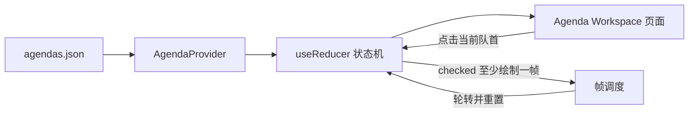
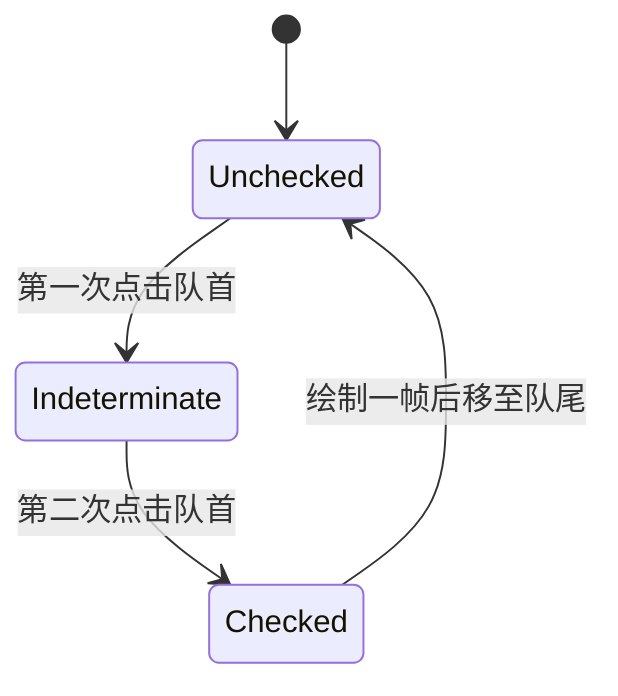

# Desktop Agenda 循环队列设计方案

> updated_by: HBR - GPT-5
> updated_at: 2026-07-12 17:24:40

## 一、目标范围

在 Desktop 的 Menu 中新增 `Agenda`：

- 位于 `Dashboard` 与 `Blames` 之间。
- 点击后唤起左侧既有 Workspace。
- Workspace 导航至 `/agenda`。
- Agenda 展示一个由 React 内存管理的循环队列。
- 不接数据库、不写磁盘、不使用 Rust 全局状态。
- 应用重启后恢复 JSON 中的初始顺序。

当期不包含：

- 数据库和后端接口。
- 状态持久化。
- Agenda 移动动画。
- Agenda 增删改。
- 多窗口共享 Agenda 状态。

## 二、整体架构



采用 React 内置能力：

- `AgendaProvider` 位于 Workspace 应用顶层。
- `useReducer` 管理队列和 Checkbox 状态。
- Context 提供全局读取和操作能力。
- 不引入 Redux、Zustand 等依赖。
- 不增加 Tauri Command。
- 不使用 Tauri Store。

Provider 位于 Workspace 根组件中、路由组件之外，因此：

- Workspace 隐藏再显示时状态保留。
- Agenda 切换到 Blames 再返回时状态保留。
- 应用退出重启后状态重置。
- Webview 被主动刷新时状态也会重置，符合不持久化约束。

## 三、菜单与路由

菜单顺序：

```text
Overview
├── Dashboard
├── Agenda
└── Blames
```

导航链路：

```text
点击 Agenda
→ Menu 调用 onNavigate("/agenda")
→ 显示已有 workspace 窗口
→ emitTo("workspace", "desktop:navigate", "/agenda")
→ Workspace 更新 hash
→ React Router 匹配 /agenda
→ 渲染 Agenda 页面
```

继续沿用现有 Menu 行为：

- 第一次点击 Agenda 时显示 Workspace。
- Agenda 已激活时再次点击，隐藏 Workspace。
- 从 Agenda 点击其他菜单时复用 Workspace，只切换路由。
- 不创建新的 Tauri Window。

## 四、数据定义

当期使用普通 JSON，包含三条模拟数据：

```json
[
  {
    "id": "AGENDA-001",
    "name": "Review pending decisions"
  },
  {
    "id": "AGENDA-002",
    "name": "Check scheduled tasks"
  },
  {
    "id": "AGENDA-003",
    "name": "Inspect recent blames"
  }
]
```

静态业务类型：

```text
Agenda {
  id: string
  name: string
}
```

标题不写入 JSON，也不保存到状态：

```text
title = id + ": " + name
```

标题通过纯计算函数或 selector 生成，避免 `id`、`name` 与 `title` 不一致。

## 五、运行时状态

每个 Agenda 在初始化时转换为运行时 Item：

```text
AgendaItem {
  agenda: Agenda
  checkboxState:
    | "unchecked"
    | "indeterminate"
    | "checked"
}
```

Provider 状态：

```text
AgendaState {
  items: AgendaItem[]
}
```

初始状态：

```text
AGENDA-001 unchecked
AGENDA-002 unchecked
AGENDA-003 unchecked
```

以下属性不存入状态，全部派生：

- `title`：由 `id` 和 `name` 计算。
- `clickable`：当前数组下标是否为 `0`。
- `disabled`：当前数组下标是否大于 `0`。
- 当前 Agenda：`items[0]`。
- 队列为空：`items.length === 0`。

## 六、状态机



示例：

```text
初始：
[ ] A
[ ] B disabled
[ ] C disabled

第一次点击 A：
[-] A
[ ] B disabled
[ ] C disabled

第二次点击 A：
[x] A
[ ] B disabled
[ ] C disabled

至少绘制一帧后：
[ ] B
[ ] C disabled
[ ] A disabled
```

Reducer 只接受两个领域动作：

```text
ACTIVATE_HEAD
ROTATE_COMPLETED_HEAD
```

`ACTIVATE_HEAD`：

- 队列为空时忽略。
- 队首为 `unchecked` 时改为 `indeterminate`。
- 队首为 `indeterminate` 时改为 `checked`。
- 队首已经为 `checked` 时忽略。
- 非队首没有操作入口。

`ROTATE_COMPLETED_HEAD`：

- 仅在队首为 `checked` 时执行。
- 取出队首。
- 将其状态重置为 `unchecked`。
- 将其追加到数组末尾。
- 新队首自然成为唯一可点击项。

Reducer 保持纯函数，不直接操作 DOM、计时器或 `requestAnimationFrame`。

## 七、绘制帧保证

第二次点击不能在同一次 React 更新中直接完成轮转，否则 `[x]` 可能不会进入真实绘制。

由 Provider 中的 Effect 观察队首状态：

1. Reducer 将队首设为 `checked`。
2. React 提交 Checkbox 的 `[x]` DOM。
3. 安排第一层 `requestAnimationFrame`。
4. 第一层回调再安排第二层 `requestAnimationFrame`。
5. 第二层回调派发 `ROTATE_COMPLETED_HEAD`。

采用双层 `requestAnimationFrame` 的目的：

- 保证 `checked` DOM 至少获得一次浏览器绘制机会。
- 不添加固定毫秒延迟。
- 不引入动画。
- 用户可能看不到这一帧，但技术上它真实存在。
- 未来可在这一阶段插入移动动画。

防御规则：

- Effect 清理时取消尚未执行的帧回调。
- React Strict Mode 重复执行 Effect 时，旧回调被清理。
- Reducer 只允许 `checked` 队首轮转，重复派发不会连续移动两个 Item。
- `checked` 阶段禁止继续点击，避免重复提交。

## 八、Context 能力

Agenda Context 对页面暴露最小接口：

```text
items
activateHead()
```

轮转动作不暴露给页面，由 Provider 内部的绘制帧 Effect 自动完成。

这样可以保证：

- 页面不能绕过状态机任意调整顺序。
- 页面不能直接修改 Checkbox 状态。
- 队列轮转和绘制时序集中在一个地方。
- 将来增加动画时只调整 Provider 内完成阶段，不修改 Agenda 页面业务操作。

当 Context 缺少 Provider 时，消费 Hook 应明确失败，而不是静默返回空数据，以便及时发现错误挂载。

## 九、Agenda 页面

页面结构：

```text
Agenda

┌─────────────────────────────────────────┐
│ [ ] AGENDA-001: Review pending decisions│ 可点击
├─────────────────────────────────────────┤
│ [ ] AGENDA-002: Check scheduled tasks   │ 禁用
├─────────────────────────────────────────┤
│ [ ] AGENDA-003: Inspect recent blames   │ 禁用
└─────────────────────────────────────────┘
```

交互规则：

- 整个队首 Item 均可点击，不要求精确点击 Checkbox。
- 非队首 Item 不响应鼠标和键盘操作。
- 队首支持键盘聚焦和 Space、Enter 操作。
- `checked` 绘制阶段临时禁止再次点击。
- 空数组时显示 `No agendas available.`，不渲染可操作 Checkbox，也不产生帧调度。

## 十、daisyUI 样式

项目当前使用 daisyUI `4.4.24`，已经支持：

- `.checkbox`
- `:checked`
- `:indeterminate`
- `:disabled`
- light、dark 主题

视觉映射：

| 运行状态 | Checkbox | Item |
| --- | --- | --- |
| 队首 `unchecked` | 空选 | 正常颜色、可聚焦、pointer、hover |
| 队首 `indeterminate` | 半选 | 强调色、可继续点击 |
| 队首 `checked` | 全选 | success 色、暂时禁止点击 |
| 非队首 | 空选并 disabled | 降低透明度、not-allowed |

`indeterminate` 是 DOM 属性，不是普通 HTML attribute；React 展示层需要把运行状态同步到真实 Checkbox 的 `indeterminate` 属性。

当期不增加：

- CSS transition。
- 移动动画。
- 人为停留时间。
- 自定义 Checkbox 图标。

## 十一、组件边界

- `agendas.json`：静态模拟数据。
- Agenda 类型：静态定义与运行时 Item 类型。
- Agenda reducer：纯状态转换。
- Agenda Context/Provider：初始化、全局读取、帧调度。
- Agenda 页面：列表渲染和用户输入。
- Agenda Item：单条展示、Checkbox DOM 状态映射。
- 菜单配置：新增 `/agenda`。
- Workspace 路由：注册 Agenda 页面。
- Workspace 根组件：挂载 Provider。

主要接入点：

- `packages/desktop/src/router/menu.ts`
- `packages/desktop/src/router/index.tsx`
- `packages/desktop/src/App-workspace.tsx`

不需要修改 Rust、Tauri 配置或 capabilities。

## 十二、异常与边界

- JSON 为空：显示空状态。
- 只有一个 Agenda：第二次点击后仍回到原位置并重置为空选。
- 快速双击：第一次进入半选，第二次进入全选，后续点击在轮转前被忽略。
- 非队首触发操作：UI 禁用，Reducer 也不提供按任意 ID 激活的能力。
- 路由切换：Provider 不卸载，状态保持。
- Workspace 隐藏：React 树不卸载，状态保持。
- 应用重启：重新从 JSON 初始化。
- Theme 切换：继续使用现有 daisyUI light、dark 主题。
- Strict Mode：Effect 清理与 Reducer 条件共同保证不发生重复轮转。

## 十三、验收标准

1. Menu 顺序为 `Dashboard → Agenda → Blames`。
2. 点击 Agenda 后，左侧既有 Workspace 出现。
3. Workspace 路由为 `/agenda`。
4. 初始顺序为 `AGENDA-001 → AGENDA-002 → AGENDA-003`。
5. 只有第一条可以点击。
6. 第一次点击第一条后显示半选 `[-]`，顺序不变。
7. 第二次点击后，全选 `[x]` 至少进入一次真实绘制。
8. 随后第一条移动到末尾并重置为空选。
9. 新的第一条成为唯一可点击项。
10. 切换路由或隐藏 Workspace 不重置队列。
11. 应用重启后恢复 JSON 初始顺序。
12. 不发生磁盘写入。
13. 不调用 Rust 或 Tauri 状态接口。
14. 不引入动画或额外状态管理依赖。
15. light、dark 主题下均能区分可点击、禁用、半选和全选状态。

## 十四、未来扩展边界

未来动画可插入 `checked → rotate` 阶段，而不改变状态机其他部分。

未来数据库或后端接口的形态尚未确定，当期不预设数据访问抽象。待接口明确后，再决定仅替换 JSON 初始化来源，还是将整个状态机迁移至后端。
