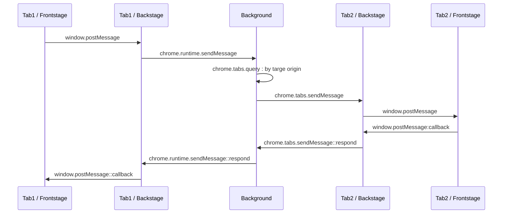

# Backstage

Tabs can call other tabs, awaiting promised callback, via *magic*.


```javascript
// Tab 1: https://tab1.com
const res = await backstage.invoke('https://tab2.com/*', 'GET', '/api/ping');

// Tab 2: https://tab2.com
backstage.route('GET', '/api/ping', (ctx, next) => {
  ctx.body = { code: 0, message: 'pong' };
  next();
});
```


