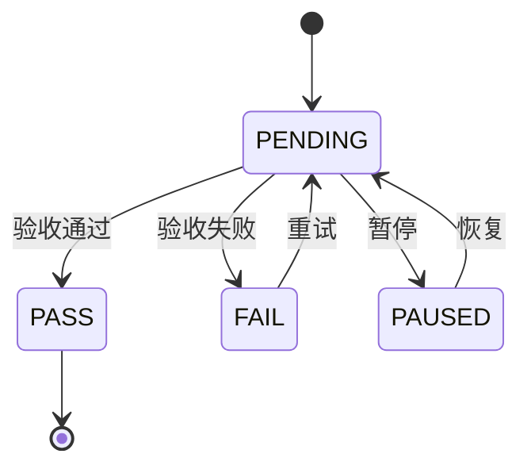

# 602 - 计划管理系统规范与实现

> updated_by: Warp - Claude-Sonnet-3.5
> updated_at: 2026-03-19 12:00:38

## Requirements（需求）

### 目标

建立一套标准化的计划管理规范，支持：
1. 多层次的计划体系（Plan → Phase → Task）
2. 与 Gitea 的集成映射
3. 清晰的任务执行、验收、追溯流程

### 范围

- 定义计划的数据结构与组成部分（Requirements / Design / Specs / Tasks）
- 规范 Phase 和 Task 的定义、编号、排序规则
- 设计与 Gitea 的映射架构
- 制定任务的 DCA（Do / Check / Act）执行模式

### 约束

- 任务分解采用严格的两层结构（Phase - Task），禁止多余层级
- 所有信息必须包含在 Do 和 Check 中，禁止添加额外字段
- 状态转移采用明确的规则引擎控制，遵循 DDD 富血模型

### 验收标准

- 所有 Phase 和 Task 的定义与规则都已明确文档化
- Gitea 映射方案已设计完成并可操作
- 任务编号规则已确定且支持快速识别

---

## Design（设计）

### 系统架构

```
计划管理系统
├─ 计划层 (Plan)
│  └─ 数据来源：Gitea Repo
├─ 阶段层 (Phase)
│  └─ 数据来源：Gitea Milestone
├─ 任务层 (Task)
│  └─ 数据来源：Gitea Issue（通过 Milestone 关联）
└─ 状态管理 (State Machine)
   ├─ Task 状态转移
   ├─ Phase 自动完成规则
   └─ 依赖关系验证
```

### 关键设计决策

1. **两层结构**：使用 Phase 作为"逻辑分组"，Task 作为"最小执行单元"
2. **DCA 模式**：每个 Task 包含明确的 Do（执行）、Check（验收）和 Act（结果），支持完整的闭环验收
3. **Gitea 集成**：充分利用现有的 Gitea 基础设施，避免维护独立的数据库
4. **依赖管理**：Task 支持依赖声明，确保任务执行的拓扑有序性
5. **Adapter 设计**：详见下方 [Gitea Adapter 设计](#gitea-adapter-设计)

### Gitea Adapter 设计

Adapter（`internal/gitea/adapter.go`）是一层很薄的封装，职责仅限于抹平 Gitea SDK 接口与项目约定之间的差异。

**适配维度**：
- **命名规范**：SDK 原始命名（如 `ListUserRepos`）→ 项目约定的命名（如 `ListUserRepos`），Adapter 方法重命名对外暴露统一命名
- **类型规范**：SDK 可能使用 `int64` 等强类型 Id → 项目中所有 Id 均为 `string`，由 Adapter 负责入参/返回值类型转换
- **参数规范**：SDK 特有的 Option 结构、参数顺序 → 扁平化、语义化参数，由 Adapter 负责参数重组与默认值填充

**职责边界**：
- Adapter **只做**：命名对齐、类型转换、参数适配
- Adapter **不做**：业务逻辑编排、数据过滤、跨接口组合调用
- 业务逻辑编排和代码复用由 CLI 命令层（`cmd/`）承担
- API 封装层（`internal/gitea/api.go`）负责提供便捷的静态方法供 domain service 调用

**API 封装层设计**：
- `internal/gitea/api.go` 提供静态封装方法，如 `ListMilestoneOfRepo(username, repoName)`
- 这些方法是 Adapter 的轻量包装，供 domain service（`internal/plan/service.go`）调用

### Api Wrapper 设计

Api Wrapper（`cmd/api.go`）是对 Gitea 自身 HTTP 能力的封装层，不涉及 Plan 相关的业务知识。

**设计原则**：
- 大致遵守 RESTful 设计风格
- 获取单个对象使用 `GET` + `get` 前缀，如 `getProject`
- 获取对象列表使用自定义 method `LIST` + `list` 前缀，如 `listProject`
- 对象名称统一使用**单数形式**，如 `listProject`（非 `listProjects`）

**自定义 Method**：
- `LIST`：对应 `list` 系列方法，语义为"获取资源列表"，区别于标准 `GET` 的"获取单个资源"

**代码复用**：
- 可复用的方法统一写在 `cmd/api.go` 最下方，供 `plan.go` 等其他命令文件调用

### 数据模型

- **Task**：包含 id / name / gitea（存储原始 Gitea Issue 信息）
- **Phase**：包含 id / name / tasks[] / gitea（存储原始 Gitea Milestone 信息），无独立的 DCA，状态由 Task 聚合计算
- **Plan**：包含 id / name / phases[] / gitea（存储原始 Gitea Repo 信息）

### Domain 设计

```
cmd/plan → cmd/api      → internal/gitea/adapter + internal/gitea/api
cmd/plan → internal/plan/service → internal/gitea/api
cmd/plan → internal/plan/translator → internal/gitea
```

---

## Specs（规格）

### 核心层级模型

本计划采用三层结构，与 Gitea 对象一一映射：

- **Plan** → Gitea Repo
- **Phase** → Gitea Milestone
- **Task** → Gitea Issue（通过 Milestone 关联）

### 编号规则

- **Plan**：三位编号，格式：`PLAN-{三位数}`，如 `PLAN-102`、`PLAN-601`
- **Phase**：两位编号（00～99），格式：`PHASE-{两位数}`，如 `PHASE-00`、`PHASE-01`
- **Task**：四位编号，格式：`TASK-{PhaseId}{TaskId}`，前两位为 Phase 编号，后两位为 Task 编号
  - 示例：`PHASE-01` 下的第 1 个 Task → `TASK-0101`
  - 示例：`PHASE-01` 下的第 2 个 Task → `TASK-0102`
  - 示例：`PHASE-02` 下的第 1 个 Task → `TASK-0201`

### Task 结构规范

```markdown
- [ ] **TASK-xxxx**: {Task 标题}
  - **Dependencies**:
    - TASK-xxxx (可选，无则删除此段)
  - **Background**:
    - {背景信息/前置知识（可选，无则删除此段）}
  - **Do**:
    - [ ] {明确的执行动作 → 预期产出物}
    - [ ] {要推进的事项}
  - **Check**:
    - [ ] {验收标准（客观、可观测）}
    - [ ] {验收信号与通过/失败阈值}
  - **Act**: 待执行
```

---

## Tasks Breakdown

### Phase-01：验证 Gitea.Repo 与 Plan 映射关系

> 目标：通过实现 Plan 类型和 CLI 行为验证，确保规范中的 Plan ↔ Gitea.Repo 映射关系可行

- [x] **TASK-0101**: 实现 `listRepoOfUser` 共享方法
  - **Background**:
    - 需要实现"获取指定用户下的所有 repos"的功能，供多个 CLI 命令复用
    - Adapter 层负责抹平 SDK 命名差异（如 SDK 的 `ListUserRepos` → Adapter 的 `ListUserRepos`）
    - 业务编排和代码复用由 CLI 命令层（`cmd/`）承担，可复用方法写在 `api.go` 最下方
  - **Do**:
    - [x] 在 `cmd/api.go` 最下方实现 `listRepoOfUser(username string)` 方法 → 调用 Adapter 封装后的接口
    - [x] 方法签名：入参为用户名，返回 repos 接口 + error
    - [x] 在 api 命令的 `GET /users/:username/repos` 路由中调用此方法
    - [x] 确保 plan 命令可直接复用该方法
  - **Check**:
    - [x] 方法实现正确，符合 Adapter 设计原则（Adapter 只做命名/类型适配，业务逻辑在 cmd 层）
    - [x] api 命令正常执行 `api GET /users/plans/repos`，输出结果不变
    - [x] 方法可被 plan 命令调用（已验证）
    - [x] 代码审查通过
  - **Act**: 已完成（人工验收通过）

- [x] **TASK-0102**: 抽象 CLI 命令通用路由匹配方法
  - **Background**:
    - api 命令和 plan 命令都有路由匹配逻辑
    - 之前 `matchAPIPath` 和 `matchPlanPath` 方法存在重复代码
    - 需要抽取通用的路由匹配方法，复用逻辑
  - **Do**:
    - [x] 新建 `cmd/router.go` → 定义通用 `Route` 和 `MatchResult` 结构
    - [x] 实现 `match(routes []Route, method, path string)` 方法 → 内部处理路径验证、路由匹配、参数提取
    - [x] 错误消息内置为 "unsupported path: %s %s" → 外部只负责调用
    - [x] 重构 `cmd/api.go` → 使用 `match(apiRoutes, method, path)` 替换原有 `matchAPIPath`
    - [x] 重构 `cmd/plan.go` → 使用 `match(planRoutes, method, path)` 替换原有 `matchPlanPath`
    - [x] 删除各命令中冗余的路由分发方法（如 `routeAPI`、`routePlan`）
  - **Check**:
    - [x] `cmd/router.go` 包含且仅包含通用路由匹配逻辑
    - [x] api 命令行为不变：`api GET /users/:username/repos` 正常工作
    - [x] plan 命令行为不变：`plan LIST /apps/:appName/plans` 正常工作
    - [x] 路由匹配逻辑无重复代码
  - **Act**: 已完成（人工验收通过）

- [x] **TASK-0103**: 定义 Plan 数据类型与 Translator
  - **Background**:
    - 规范定义了 Plan 应包含 id / name / phases[] 的结构
    - 需要将规范转换为 Go 代码中可使用的类型定义，支持 Gitea Repo → Plan 的映射
    - 设计中引入了 PlanTranslator 层，负责 Gitea Repo → Plan 的转换
  - **Do**:
    - [x] 在 `internal/plan/types.go` 定义 Plan / GiteaExtra 的 Go 结构体
    - [x] Plan 内部包含 Gitea 字段（类型为 `GiteaExtra`）→ 备份完整的源元数据（Id、Name、Description、CreatedAt、UpdatedAt）
    - [x] 在 `internal/plan/translator.go` 中实现 PlanTranslator → 负责 Gitea 对象到 Plan 对象的转换
    - [x] 实现 `extractPlanId(repoName)` → 从 repo 名提取数字部分，格式化为 `PLAN-102`
    - [x] 实现 `TranslateRepoList2PlanList` / `TranslateRepo2Plan` → 过滤符合 `plan-{序号}-{名称}` 格式的 repos 并转换
    - [x] 在 `cmd/plan.go` 中实现 `planCmd` 命令框架（Cobra 子命令）
    - [x] 实现 `listPlanOfApp(appName)` → 调用 `listRepoOfUser(appName)` 并通过 Translator 转换
    - [x] 注册路由 `LIST /apps/:app/plans`，支持 JSON 输出（`--json` flag）
  - **Check**:
    - [x] 类型定义与核心层级模型一致（Plan → Repo）
    - [x] TranslateRepo2Plan 能正确过滤 `plan-{序号}-{名称}` 格式的 repos
    - [x] Plan.Id 为 `PLAN-102` 格式，Plan.Name 透传 repo.Name
    - [x] 命令执行正常：`backstage-gitea plan LIST /apps/{appName}/plans`
    - [x] 输出为 Plan 对象列表，非原始 Repo；JSON 格式可解析
    - [x] 错误处理完善：无效应用名、网络异常有明确提示
  - **Act**: 已完成（人工验收通过）

- [x] **TASK-0104**: 验证 plan 命令执行结果
  - **Dependencies**:
    - TASK-0103
  - **Background**:
    - TASK-0103 已定义了 Plan 数据类型与 Translator
    - 需要验证 CLI 命令能成功获取并转换 Plan 数据
  - **Do**:
    - [x] 执行 `backstage-gitea plan LIST /apps/mall-view-platform/plans` → 验证命令正常执行
    - [x] 验证返回值为 Plan 对象列表，包含 Id、Name、Phases、Gitea 元数据等字段
  - **Check**:
    - [x] 命令执行成功，无报错
    - [x] 输出为 Plan 对象列表（非原始 Repo），结构与核心层级模型一致
    - [x] 能正确展示应用下的所有 Plan
  - **Act**: 已完成（人工验收通过）

---

### Phase-02：数据模型与类型定义

> 目标：定义计划管理系统的核心数据结构与类型系统，为代码实现和数据持久化奠定基础

- [x] **TASK-0201**: 实现 `plan GET /apps/:app/plans/:planName` 命令
  - **Dependencies**:
    - TASK-0103
  - **Background**:
    - 已完成列表查询 `plan LIST /apps/:app/plans`
    - 需要实现单个 Plan 的详情查询
    - 用 Plan.Name（即完整的 Gitea Repo 名）作为查询参数
  - **Do**:
    - [x] 向 `planRoutes` 新增路由 `GET /apps/:app/plans/:planName`
    - [x] 在 `cmd/plan.go` 中实现 `showPlan(app, planName)` → 返回 `*plan.Plan`
    - [x] 调用 `showRepo(app, planName)` 获取单个 Repo，通过 Translator 转换为 Plan
    - [x] 确保 Phases 字段为空数组 `[]` 而非 nil
  - **Check**:
    - [x] 命令可执行：`backstage-gitea plan GET /apps/mall-view-platform/plans/plan-102-HttpClient-Rules`
    - [x] 返回单个 Plan 对象，包含 Id、Name、Gitea 元数据
    - [x] Phases 字段为空数组，不报错
    - [x] 错误处理完善：planName 不存在、网络异常有明确提示
  - **Act**: 已完成（人工验收通过）

- [x] **TASK-0202**: 在 showPlan 中补充 Phases 字段（映射 Gitea Milestone）
  - **Dependencies**:
    - TASK-0201
  - **Background**:
    - TASK-0201 已实现 showPlan 命令，当前 Phases 字段为空数组 `[]`
    - 核心层级模型：Phase → Gitea Milestone
    - 需要从 Gitea Repo 获取 Milestones，转换为 Phases 列表
  - **Do**:
    - [x] 在 API 封装层实现 `ListMilestoneOfRepo(username, repoName)` → 调用 Adapter 的 `ListRepoMilestones`，抹平 SDK 命名/类型差异
    - [x] 在 PlanTranslator 中实现 `TranslateMilestoneList2PhaseList(milestones) → []Phase` → 转换 Milestones 为 Phases
    - [x] 在 `showPlan` 中调用上述方法，补充 Plan 对象的 Phases 字段
  - **Check**:
    - [x] API 封装方法遵循设计原则：命名对齐、参数扁平化
    - [x] TranslateMilestoneList2PhaseList 能正确转换 Milestones
    - [x] showPlan 返回的 Plan 对象中 Phases 非空，每个 Phase 包含 Id 和 Name
    - [x] 错误处理完善：无 Milestones、API 调用失败有明确提示
  - **Act**: 已完成（人工验收通过）

- [x] **TASK-0203**: 实现命令 LIST /apps/:app/plans/:planName/phases/:phaseId/tasks
  - **Dependencies**:
    - TASK-0202
  - **Background**:
    - 已实现 `LIST /apps/:app/plans` 和 `GET /apps/:app/plans/:planName`
    - 需要扩展第三级查询：获取指定 Phase 下的所有 Tasks
    - Phase 参数使用 Id（如 `PHASE-02`），非 Name
  - **Do**:
    - [x] 扩展 `internal/plan/service.go`：
      - [x] 添加 `TranslatePhaseId2MilestoneId(appName, planName, phaseId)` → 根据 Phase Id 查找对应的 Milestone ID
    - [x] 扩展 PlanTranslator（`internal/plan/translator.go`）：
      - [x] 添加 `TranslateIssueList2TaskList(issues)` → Issue 列表转换为 Task 列表
      - [x] 添加 `TranslateIssue2Task(issue)` → 单个 Issue 转换为 Task
      - [x] 添加 `ExtractTaskId(issueTitle)` → 从 Issue 标题提取 Task ID
    - [x] 扩展 `cmd/plan.go`：
      - [x] 新增路由 `LIST /apps/:app/plans/:planName/phases/:phaseId/tasks`
      - [x] 实现 `listTaskOfPhase(appName, planName, phaseId string)` 处理函数：
        1. 调用 `TranslatePhaseId2MilestoneId()` 获取 Milestone ID
        2. 调用 `adapter.ListRepoIssues()` 获取 Issues
        3. 过滤属于指定 Milestone 的 Issues
        4. 通过 `TranslateIssueList2TaskList()` 转换为 Tasks
  - **Check**:
    - [x] Phase Id 能正确匹配到对应的 Milestone（忽略大小写前缀匹配）
    - [x] Issues 正确转换为 Task 对象，包含 Id、Name、Gitea 元数据等
    - [x] phaseId 不存在时返回有意义的错误信息
    - [x] 命令测试通过：`backstage-gitea plan LIST /apps/{app}/plans/{planName}/phases/PHASE-02/tasks`
  - **Act**: 已完成（人工验收通过）

---

### Phase-03：扩展数据模型与类型系统

> 目标：完善计划管理系统的核心数据结构与类型系统，为后续的 Gitea 集成奠定基础

- [ ] **TASK-0301**: 扩展核心数据结构
  - **Dependencies**:
    - TASK-0203
  - **Background**:
    - Phase-02 已定义了基本的 Plan / Phase / Task 类型
    - 需要进一步完善类型系统，包括状态枚举、验证方法、序列化接口等
  - **Do**:
    - [ ] 补充 TaskStatus 枚举类型定义 → PENDING / PASS / FAIL / PAUSED
    - [ ] 补充状态转移规则的类型接口 → 验证合法转移
    - [ ] 补充 Plan 聚合计算方法 → 如 GetPhaseProgress()、GetTaskProgress() 等
    - [ ] 补充序列化方法 → JSON Marshal / Unmarshal
  - **Check**:
    - [ ] 所有状态转移都与规范的 Mermaid 图保持一致
    - [ ] 类型定义支持与 Gitea 对象的完整映射
    - [ ] 序列化测试通过，数据往返无损
  - **Act**: 待执行

- [ ] **TASK-0302**: 定义依赖关系与验证规则
  - **Dependencies**:
    - TASK-0301
  - **Background**:
    - 规范定义了 Task 之间的依赖关系和 Phase 的顺序约束
    - 需要实现验证逻辑，确保依赖关系的正确性
  - **Do**:
    - [ ] 实现 DependencyValidator → 验证 Task 依赖是否有效、是否成环
    - [ ] 实现 PhaseSequenceValidator → 验证 Phase 不能被跳过
    - [ ] 实现 TaskStatusValidator → 验证状态转移合法性
    - [ ] 添加完整的错误诊断信息
  - **Check**:
    - [ ] 依赖验证能检测出环形依赖并报错
    - [ ] Phase 顺序约束被强制执行
    - [ ] 所有验证规则都有明确的错误提示
  - **Act**: 待执行

---

### Phase-04：Gitea 集成适配

> 目标：实现规范与 Gitea 之间的双向映射，使计划能够在 Gitea 平台上执行和追踪

- [ ] **TASK-0401**: 验证 Phase-03 完成情况
  - **Background**:
    - Phase-03 扩展了数据模型和类型系统
    - 需要在开始 Phase-04 前确认所有类型定义已完成且可用
  - **Do**:
    - [ ] 复查所有类型定义文件的完整性
    - [ ] 验证所有验证方法都已实现
    - [ ] 检查是否有遗留的类型定义要求
  - **Check**:
    - [ ] Phase-03 的所有验收标准都已满足
    - [ ] 类型系统已稳定，可用于后续阶段
    - [ ] 所有验证规则都已实现
  - **Act**: 待执行

- [ ] **TASK-0402**: 设计 Gitea API 映射层扩展
  - **Dependencies**:
    - TASK-0401
  - **Background**:
    - Phase-02 已验证了基本的 Gitea Repo ↔ Plan 映射
    - 需要扩展适配层以支持完整的 Plan / Phase / Task 生命周期操作
  - **Do**:
    - [ ] 分析 Gitea API：Repo 创建、Project 管理、Issue 操作 → API 能力清单
    - [ ] 设计 Plan 创建流程：Plan 对象 → 创建 Gitea Repo + 初始 Projects + Issues
    - [ ] 设计 Task 状态同步：Gitea Issue 状态 ↔ Plan Task 状态
    - [ ] 设计冲突解决策略：Gitea 侧修改 vs Plan 侧修改的冲突处理
  - **Check**:
    - [ ] API 能力清单覆盖所有规范需要的操作
    - [ ] 映射层设计无歧义，可被代码实现
    - [ ] 冲突处理策略清晰且可执行
  - **Act**: 待执行

- [ ] **TASK-0403**: 实现 Gitea 适配器扩展方法
  - **Dependencies**:
    - TASK-0402
  - **Background**:
    - gitea.Adapter 已包含基础的 CRUD 操作
    - 需要添加支持 Plan 生命周期的新方法
  - **Do**:
    - [ ] 在 gitea.Adapter 中添加：CreatePlanRepo()、UpdateTaskStatus()、SyncPlanState() 等方法
    - [ ] 在 PlanTranslator 中添加：CreateGiteaStructureFromPlan()、SyncPlanWithGitea() 等方法
    - [ ] 添加错误处理和重试机制
  - **Check**:
    - [ ] 所有新增方法都有完整的错误处理
    - [ ] DCA 流程中的所有状态转移都能正确映射到 Gitea
    - [ ] 适配层能处理 Gitea API 的限制和超时
  - **Act**: 待执行

---

### Phase-05：执行引擎与验收机制

> 目标：实现计划的执行引擎，支持 Task 的完整 DCA 流程和 Phase 的自动化管理

- [ ] **TASK-0501**: 验证 Phase-04 完成情况
  - **Background**:
    - Phase-04 实现了与 Gitea 的完整适配
    - 需要确认映射层已完整可用，可以作为执行引擎的基础
  - **Do**:
    - [ ] 测试 Gitea 适配器的所有新增 CRUD 操作
    - [ ] 验证双向映射的一致性（Plan ↔ Gitea）
    - [ ] 检查是否有遗留的适配需求
  - **Check**:
    - [ ] 适配器测试通过率 ≥ 95%
    - [ ] 双向映射数据一致性验证通过
    - [ ] Phase-04 的所有验收标准都已满足
  - **Act**: 待执行

- [ ] **TASK-0502**: 实现 Task 执行引擎
  - **Dependencies**:
    - TASK-0501
  - **Background**:
    - 已定义了 Task 的 DCA 结构和状态转移规则
    - 需要实现一个执行引擎，支持 Task 的自动执行流程控制
  - **Do**:
    - [ ] 实现 TaskExecutor → 支持 Task 的执行调度和状态管理
    - [ ] 实现 DependencyResolver → 验证依赖关系并确定执行顺序
    - [ ] 实现 StateTransitionValidator → 验证状态转移的合法性
    - [ ] 添加执行日志和追踪机制
  - **Check**:
    - [ ] Task 的所有合法状态转移都能正确执行
    - [ ] 非法状态转移被及时阻止
    - [ ] 依赖关系正确解析且无环
    - [ ] 执行日志完整且可追踪
  - **Act**: 待执行

- [ ] **TASK-0503**: 实现 Do 和 Check 的验收机制
  - **Dependencies**:
    - TASK-0502
  - **Background**:
    - Task 中的 Do 和 Check 包含具体的执行动作和验收标准
    - 需要实现一套验收机制，支持自动和手动的验收方式
  - **Do**:
    - [ ] 设计验收机制的架构：自动验收、手动验收、混合验收
    - [ ] 实现 AutoValidator → 支持规则驱动的自动验收
    - [ ] 实现 ManualValidator → 支持人工验收的交互流程
    - [ ] 实现 CheckpointRecorder → 记录验收结果和决策过程
  - **Check**:
    - [ ] 自动验收规则能正确评估 Check 中的条件
    - [ ] 手动验收流程包含清晰的决策呈现和结果记录
    - [ ] 验收结果能正确驱动 Task 的状态转移
    - [ ] 所有验收过程都有完整的审计日志
  - **Act**: 待执行

- [ ] **TASK-0504**: 实现 Phase 自动化管理
  - **Dependencies**:
    - TASK-0503
  - **Background**:
    - Phase 的完成状态由其包含的所有 Task 的状态聚合而成
    - 需要实现自动化规则，支持 Phase 的自动升级和梯度管理
  - **Do**:
    - [ ] 实现 PhaseManager → 支持 Phase 的生命周期管理
    - [ ] 实现 Phase 完成判定规则 → 所有 Task = PASS 时自动完成
    - [ ] 实现 Phase 返修机制 → 当检测到规范需要返修时的处理流程
    - [ ] 添加 Phase 级别的依赖检查 → 禁止跳过 Phase
  - **Check**:
    - [ ] Phase 完成状态能正确聚合 Task 状态
    - [ ] Phase 返修流程能正确暂停执行并记录决策
    - [ ] Phase 与 Phase 之间的依赖被正确强制
    - [ ] 无法跳过任何 Phase
  - **Act**: 待执行

---

### Phase-05 末期检查：规范返修与设计验证

- [ ] **TASK-0505**: 判断规范是否需要返修
  - **Dependencies**:
    - TASK-0504
  - **Background**:
    - Phase-05 的工作已经接近完成，需要在收尾时判断是否有设计或规范上的遗漏或需要调整的地方
    - 这是一个"gate check"，确保所有实现都与规范保持一致
  - **Do**:
    - [ ] 复查整个实现过程中发现的任何与规范不符的地方 → 不符合清单
    - [ ] 确认是否有规范遗漏、歧义或新发现的需求 → 遗漏清单
    - [ ] 评估当前的实现是否满足原始的 Requirements → 兼容性评估文档
  - **Check**:
    - IF 无遗漏且实现与规范 100% 一致 THEN：
      - [ ] 标记为 PASS，继续到下一阶段
    - ELSE（有遗漏或不一致）THEN：
      - [ ] 暂停当前 Phase，返回更新 Specs / Design / Requirements
      - [ ] 重新进行第 2 轮的任务拆分和实现
  - **Act**: 待执行

---

## 附录：规范参考与工具提示

### A1. Task 结构模板

```markdown
- [ ] **TASK-xxxx**: {Task 标题}
  - **Dependencies**:
    - TASK-xxxx (可选，无则删除)
  - **Background**:
    - {背景信息}
  - **Do**:
    - [ ] {执行动作 → 产出}
  - **Check**:
    - [ ] {验收标准}
  - **Act**: 待执行
```

### A2. Task 状态转移图



### A3. Phase 执行原则

1. **第一个 Task**：验证上一 Phase 完成情况
2. **最后一个 Task**：判断规范是否需要返修
3. **严格顺序**：禁止跳过任何 Phase 或 Task
4. **自动完成**：所有 Task = PASS → Phase 自动标记完成

### A4. Gitea 映射表

| 计划概念 | Gitea 对象 | 说明 |
|---------|----------|------|
| Plan | Repo | 名称：`plan-{序号}-{名称}` |
| Phase | Milestone | 标题：`Phase-00`, `Phase-01`, ... |
| Task | Issue | 标题：`TASK-xxxx: {标题}`，通过 Milestone 关联 |
| PENDING | Issue Open | 待执行 |
| PASS | Issue Closed | 验收通过 |
| FAIL | Issue Open + 标签 fail | 验收失败 |
| PAUSED | Issue Open + 标签 paused | 已暂停 |

### A5. 编号规则速查

- Phase Id：`PHASE-00` ~ `PHASE-99`（最多 100 个）
- Task Id：`TASK-{PhaseId}{TaskId}`
  - `PHASE-01` 的第 1 个 Task → `TASK-0101`
  - `PHASE-02` 的第 3 个 Task → `TASK-0203`
  - `PHASE-10` 的第 15 个 Task → `TASK-1015`

### A6. 关键约束清单

- [ ] 两层结构，不能多层级
- [ ] Task 禁止提及复杂度、工时
- [ ] 所有信息必须在 Do / Check 中
- [ ] 禁止添加额外字段（Background / Dependencies 外）
- [ ] Phase 内严格顺序，禁止跳过
- [ ] 每个 Phase 的首尾 Task 有特殊职责

### A7. 验收清单

执行计划前，请确认：

- [ ] 所有 Phase 和 Task 都已清晰定义
- [ ] 依赖关系完整且无环
- [ ] 每个 Task 的 Do 和 Check 都明确可验证
- [ ] Gitea 映射方案已确认可行
- [ ] 负责人和截止期限已确认（若需要）

### A8. 已实现功能清单（代码对照）

| 功能 | 文件位置 | 状态 |
|-----|---------|------|
| 通用路由匹配 | `cmd/router.go` | ✅ 已完成 |
| Plan 类型定义 | `internal/plan/types.go` | ✅ 已完成 |
| PlanTranslator | `internal/plan/translator.go` | ✅ 已完成 |
| listPlanOfApp | `cmd/plan.go` | ✅ 已完成 |
| showPlan（含 Phases） | `cmd/plan.go` | ✅ 已完成 |
| listTaskOfPhase | `cmd/plan.go` | ✅ 已完成 |
| TranslatePhaseId2MilestoneId | `internal/plan/service.go` | ✅ 已完成 |
| ListMilestoneOfRepo | `internal/gitea/api.go` | ✅ 已完成 |
| listRepoOfUser 共享方法 | `cmd/api.go` | ✅ 已完成 |

### A9. 路由清单

| 命令 | 方法 | 路径 |
|-----|------|------|
| plan LIST | LIST | `/apps/:app/plans` |
| plan GET | GET | `/apps/:app/plans/:planName` |
| plan LIST | LIST | `/apps/:app/plans/:planName/phases/:phaseId/tasks` |
| api GET | GET | `/users/:username/repos` |
| api GET | GET | `/repos/:username/:repoName` |
| api GET | GET | `/repos/:username/:repoName/issues` |
| api GET | GET | `/repos/:username/:repoName/milestones` |
| api GET | GET | `/repos/:username/:repoName/milestones/:milestonePrefix/issues` |
