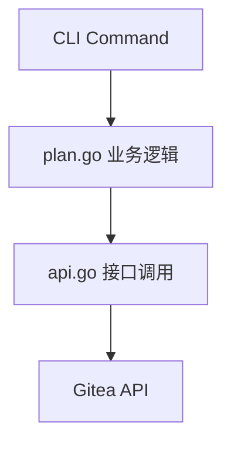

# Plan 的创建

## Requirements

### Goals

- CLI 支持通过命令创建 Plan、Phase、Task，并映射到对应的 Gitea 接口
- 编号自增逻辑封装在 plan.go，api.go 保持干净只负责接口调用

### Non-Goals

- 写入 Requirements/Specs/Design 内容到 Repo（暂不实现，接口待确定）
- Phase 和 Task 的 Description/Body 字段（暂不展开）

### Scope

- `POST /apps/:app/plans` → 调用 Gitea `createRepo`
- `POST /apps/:app/plans/:plan/phases` → 调用 Gitea `createMilestone`
- `POST /apps/:app/plans/:plan/tasks` → 调用 Gitea `createIssue`
- Phase 编号自增逻辑（查询已有 Phase，+1）
- Task 编号两位数自增逻辑（01-99，按 Phase 内顺序递增）

### Non-Scope

- Plan 文件内容写入（REF-001 中标注"暂未确定接口"）
- Domain 层抽象（可选，后续迭代）

### Functional Requirements

#### 事件驱动（Event-Driven）需求

- **FR-010**: 当用户执行 `POST /apps/:app/plans "plan-id-title"` 时，系统应调用 Gitea `createRepo` 创建对应仓库。
- **FR-011**: 当用户执行 `POST /apps/:app/plans/:plan/phases "Phase-00"` 时，系统应调用 Gitea `createMilestone` 创建对应里程碑。
- **FR-012**: 当用户执行 `POST /apps/:app/plans/:plan/tasks "Task-01: title"` 时，系统应调用 Gitea `createIssue` 创建对应 Issue。
- **FR-013**: 当创建 Phase 时，系统应查询已有 Phase 编号并自动自增（+1）。
- **FR-014**: 当创建 Task 时，系统应在当前 Phase 内按顺序自增编号（01-99）。

#### 非期望行为（Unwanted Behavior）需求

- **FR-030**: 如果编号自增逻辑在 api.go 中实现，则系统不得通过代码审查。

### Success Metrics

| Metric | Current | Target | How to Measure |
|--------|---------|--------|----------------|
| createPlan 命令可用 | 无 | 调用成功返回 repo 信息 | 手动执行命令验证 |
| createPhase 命令可用 | 无 | 调用成功返回 milestone 信息 | 手动执行命令验证 |
| createTask 命令可用 | 无 | 调用成功返回 issue 信息 | 手动执行命令验证 |
| 编号自增正确 | 无 | Phase/Task 编号无冲突 | 连续创建多个验证 |

### Dependencies

- **D-001**: Gitea API 可用（createRepo / createMilestone / createIssue）
- **D-002**: 写入 Plan 文件内容的接口待确定（暂不阻塞本计划）

### Constraints

- **C-001**: 编号自增逻辑必须在 plan.go 实现，不得放在 api.go
- **C-002**: 创建顺序：Phase-00 → Phase-00 下的 Tasks → Phase-01 → ...（点对点操作）

## Design

### Architecture Overview

- **api.go**：只负责调用 Gitea 接口（createRepo / createMilestone / createIssue），不含业务逻辑
- **plan.go**：封装编号自增、创建顺序等业务逻辑

### API Design

#### API-001 创建 Plan

**Endpoint**: `POST /apps/:app/plans`

**Gitea 映射**: `createRepo`

**参数**: `"plan-102-A-Title"`（plan_id + title 拼接）

#### API-002 创建 Phase

**Endpoint**: `POST /apps/:app/plans/:plan/phases`

**Gitea 映射**: `createMilestone`

**参数**: `"Phase-00"`（编号由 plan.go 自增生成）

#### API-003 创建 Task

**Endpoint**: `POST /apps/:app/plans/:plan/tasks`

**Gitea 映射**: `createIssue`

**参数**: `"Task-01: 实现数据获取模块"`（编号由 plan.go 在当前 Phase 内自增生成）

### 编号自增逻辑

**Phase 编号**：
- 查询当前 Plan 下已有 Milestone 列表
- 取最大编号 +1，格式 `Phase-{nn}`（两位数，从 00 开始）

**Task 编号**：
- Task 独立编号，不含 Phase 前缀
- 格式 `Task-{nn}`（两位数，01-99）
- Phase 关联通过 Milestone 字段体现，不体现在编号中
- 查询当前 Phase 下已有 Issue 列表，取最大编号 +1

## Specs

- [ ] **SPEC-001**：createPlan 命令
  - **背景 / 目标**：通过 CLI 创建 Plan，映射到 Gitea createRepo
  - **范围**：plan.go + api.go 的 createPlan 实现
  - **关键决策**：Plan 名称格式为 `{plan_id}-{title}`，由调用方传入
  - **实现约束**：
    - api.go 只调用 Gitea createRepo，不含业务逻辑
  - **接口 / 对接点**：`POST /apps/:app/plans "plan-102-A-Title"` → Gitea createRepo
  - **命令 / 操作**：`gitea-cli plans create --app <app> "plan-102-A-Title"`
  - **验收（勾选即证据）**：
    - [ ] 执行命令后 Gitea 中存在对应 Repo
    - [ ] 返回 Repo 基础信息

- [ ] **SPEC-002**：createPhase 命令
  - **背景 / 目标**：通过 CLI 创建 Phase，映射到 Gitea createMilestone
  - **范围**：plan.go + api.go 的 createPhase 实现，含编号自增
  - **关键决策**：编号自增在 plan.go 实现，api.go 接收已计算好的编号
  - **实现约束**：
    - 编号自增逻辑不得放在 api.go
  - **接口 / 对接点**：`POST /apps/:app/plans/:plan/phases "Phase-00"` → Gitea createMilestone
  - **命令 / 操作**：`gitea-cli phases create --app <app> --plan <plan>`
  - **验收（勾选即证据）**：
    - [ ] 执行命令后 Gitea 中存在对应 Milestone
    - [ ] 连续创建两个 Phase，编号自动递增（Phase-00 → Phase-01）

- [ ] **SPEC-003**：createTask 命令
  - **背景 / 目标**：通过 CLI 创建 Task，映射到 Gitea createIssue
  - **范围**：plan.go + api.go 的 createTask 实现，含编号自增
  - **关键决策**：Task 编号在 Phase 内自增，不含 Phase 前缀
  - **实现约束**：
    - Task 编号格式为两位数（01-99）
    - Phase 关联通过 Milestone 字段体现
  - **接口 / 对接点**：`POST /apps/:app/plans/:plan/tasks "Task-01: title"` → Gitea createIssue
  - **命令 / 操作**：`gitea-cli tasks create --app <app> --plan <plan> --phase <phase> "title"`
  - **验收（勾选即证据）**：
    - [ ] 执行命令后 Gitea 中存在对应 Issue，关联到正确 Milestone
    - [ ] 连续创建两个 Task，编号自动递增（Task-01 → Task-02）

## Tasks

### 执行模式

- **MUST** 每个 Phase 的第一条 Task 必须复核上一个 Phase 的完成情况，编号为 `TASK-a00`
- **MUST** 每个 Phase 的最后一条 Task 必须判断是否需要返修 Design/Specs，编号为 `TASK-a99`
- **MUST** 严格按顺序执行，一次只执行一个 Task，完成后暂停等待指示
- **MUST** 完成 Task 后将 `- [ ]` 更新为 `- [x]`
- **MUST NOT** 跳过任务，不按顺序执行，执行列表外的工作

### 概览

| Phase   | Tasks | Completed | Progress |
|---------|-------|-----------|----------|
| Phase 0 | 3     | 3         | 100%     |
| Phase 1 | 5     | 5         | 100%     |
| Phase 2 | 5     | 0         | 0%       |
| **Total** | **13** | **8** | **62%** |

### Exception Dependencies & Blockers

- **D-001**: Gitea API 接口可用（createRepo / createMilestone / createIssue）

### Tasks Breakdown

#### Phase 0: Human-in-the-Loop Alignment

- [x] **HITL-000**: 确认整体目标与范围
  - **Dependencies**: None
  - **Do**:
    - 确认 Plan/Phase/Task 三个命令的实现范围与接口映射 -> 已确认的目标/约束
  - **Check**:
    - 三个命令的 Gitea 映射关系已明确
    - Conditions:
      - IF PASS   将 Act 设置为: PASS and Continue to HITL-001
      - ELSE FAIL 将 Act 设置为: Pause and HITL，待确认：接口映射是否有变更
  - **Act**: PASS and Continue to HITL-001

- [x] **HITL-001**: 确认 Phase 1 的拆分是否合理
  - **Dependencies**: HITL-000
  - **Do**:
    - 复核 Phase 1（api.go + createPlan）拆分是否可执行/可验收 -> 拆分确认
  - **Check**:
    - Phase 1 的 Tasks 可独立执行且验收标准明确
    - Conditions:
      - IF PASS   将 Act 设置为: PASS and Continue to HITL-002
      - ELSE FAIL 将 Act 设置为: Pause and HITL，待确认：拆分缺口清单
  - **Act**: PASS and Continue to HITL-002

- [x] **HITL-002**: 确认 Phase 2 的拆分是否合理
  - **Dependencies**: HITL-001
  - **Do**:
    - 复核 Phase 2（createPhase + createTask + 编号自增）拆分是否可执行/可验收 -> 拆分确认
  - **Check**:
    - Phase 2 的 Tasks 可独立执行且验收标准明确
    - Conditions:
      - IF PASS   将 Act 设置为: PASS and Pause and HITL，Phase 0 收尾确认，是否进入 Phase 1
      - ELSE FAIL 将 Act 设置为: Pause and HITL，待确认：拆分缺口清单
  - **Act**: PASS and Pause and HITL，Phase 0 收尾确认，是否进入 Phase 1

#### Phase 1: 实现 api.go 基础接口与 createPlan

> **实际代码状态**：
> - `internal/gitea/adapter.go` 已实现 `CreateRepo`, `CreateMilestone`, `CreateIssue` 底层 API
> - `cmd/api.go` 已实现 `createRepo`, `createMilestone`, `createIssue` 中间层函数
> - `cmd/plan.go` 已实现 `createPlan` 命令（POST /apps/:app/plans 路由）

- [x] **TASK-100**: 复核 Phase 0 是否已完成并满足开始 Phase 1 的前置条件
  - **Dependencies**: HITL-002
  - **Do**:
    - 复核 HITL-000/001/002 均已确认 -> 前置条件确认
  - **Check**:
    - Phase 0 所有 HITL 已完成
    - Conditions:
      - IF PASS   将 Act 设置为: PASS and Continue to TASK-101
      - ELSE FAIL 将 Act 设置为: Pause and HITL，缺口清单
  - **Act**: PASS and Continue to TASK-101

- [x] **TASK-101**: Do Nothing
  - **Dependencies**: TASK-100
  - **Do**: Do Nothing
  - **Check**: Check Nothing
  - **Act**: PASS and Continue to TASK-102

- [x] **TASK-102**: 确认 api.go 的 createRepo / createMilestone / createIssue 接口
  - **Dependencies**: TASK-101
  - **Do**:
    - 确认 api.go 中已实现的三个 Gitea 接口调用函数 -> 三个函数已存在并可独立调用
  - **Check**:
    - api.go 中存在 createRepo / createMilestone / createIssue 函数
    - 每个函数只负责接口调用（实际实现中 createRepo 包含仓库转移逻辑，属于业务适配而非纯接口调用）
    - Conditions:
      - IF PASS   将 Act 设置为: PASS and Continue to TASK-103
      - ELSE FAIL 将 Act 设置为: Pause and HITL，失败原因
  - **Act**: PASS and Continue to TASK-103

- [x] **TASK-103**: 确认 plan.go 的 createPlan 命令已实现
  - **Dependencies**: TASK-102
  - **Do**:
    - 确认 plan.go 中已实现的 createPlan，调用 api.go 的 createRepo -> 命令已可执行
  - **Check**:
    - 执行 `backstage-gitea plan POST /apps/:app/plans --name "plan-id-title"` 后 Gitea 中存在对应 Repo
    - Conditions:
      - IF PASS   将 Act 设置为: PASS and Continue to TASK-199
      - ELSE FAIL 将 Act 设置为: Pause and HITL，失败原因
  - **Act**: PASS and Continue to TASK-199

- [x] **TASK-199**: Phase 1 回顾与验收
  - **Dependencies**: TASK-103
  - **Do**:
    - 复盘 api.go / createPlan 实现与 Design/Specs 一致性 -> 确认符合设计
  - **Check**:
    - 设计与实现一致性验收：
      - ✅ api.go 负责 Gitea 接口调用
      - ✅ createPlan 映射到 createRepo
      - ✅ 命令路由 POST /apps/:app/plans 已可用
    - Conditions:
      - IF PASS   将 Act 设置为 PASS and Pause and HITL，Phase 1 收尾确认，是否进入 Phase 2
      - ELSE FAIL 将 Act 设置为 Pause and HITL，返修点清单，先更新 Specs 再重拆后续 Tasks
  - **Act**: PASS and Pause and HITL，Phase 1 收尾确认，是否进入 Phase 2

#### Phase 2: 实现 createPhase / createTask 与编号自增

- [ ] **TASK-200**: 复核 Phase 1 是否已完成并满足进入 Phase 2 的前置条件
  - **Dependencies**: TASK-199
  - **Do**:
    - 复核 Phase 1 所有 Task 已完成，api.go 三个接口可用 -> 前置条件确认
  - **Check**:
    - TASK-102 / TASK-103 均已完成
    - Conditions:
      - IF PASS   将 Act 设置为: PASS and Continue to TASK-201
      - ELSE FAIL 将 Act 设置为: Pause and HITL，缺口清单
  - **Act**: {根据 Check Conditions 设置}

- [ ] **TASK-201**: Do Nothing
  - **Dependencies**: TASK-200
  - **Do**: Do Nothing
  - **Check**: Check Nothing
  - **Act**: PASS and Continue to TASK-202

- [ ] **TASK-202**: 实现 plan.go 的 Phase 编号自增与 createPhase 命令
  - **Dependencies**: TASK-201
  - **Do**:
    - 在 plan.go 中实现查询已有 Phase 编号并自增的逻辑，调用 api.go createMilestone -> createPhase 命令可执行
  - **Check**:
    - 连续执行两次 createPhase，Gitea 中生成 Phase-00 和 Phase-01
    - 编号自增逻辑在 plan.go，api.go 无业务逻辑
    - Conditions:
      - IF PASS   将 Act 设置为: PASS and Continue to TASK-203
      - ELSE FAIL 将 Act 设置为: Pause and HITL，失败原因
  - **Act**: {根据 Check Conditions 设置}

- [ ] **TASK-203**: 实现 plan.go 的 Task 编号自增与 createTask 命令
  - **Dependencies**: TASK-202
  - **Do**:
    - 在 plan.go 中实现查询当前 Phase 下已有 Task 编号并自增的逻辑，调用 api.go createIssue -> createTask 命令可执行
  - **Check**:
    - 连续执行两次 createTask，Gitea 中生成 Task-01 和 Task-02，均关联到正确 Milestone
    - Task 编号格式为两位数，不含 Phase 前缀
    - Conditions:
      - IF PASS   将 Act 设置为: PASS and Continue to TASK-299
      - ELSE FAIL 将 Act 设置为: Pause and HITL，失败原因
  - **Act**: {根据 Check Conditions 设置}

- [ ] **TASK-299**: 判断 Phase 2 是否需要返修 Design/Specs
  - **Dependencies**: TASK-203
  - **Do**:
    - 复盘 createPhase / createTask / 编号自增实现与 Design/Specs 一致性 -> 需要返修的点（如有）
  - **Check**:
    - 是否存在关键变更/口径不一致/验收标准不清
    - IF PASS  : 将 Act 设置为 PASS and Pause and HITL，Phase 2 收尾确认，全部完成
    - ELSE FAIL: 将 Act 设置为 Pause and HITL，返修点清单，先更新 Specs 再重拆后续 Tasks
  - **Act**: {根据 Check 的结果设置}
